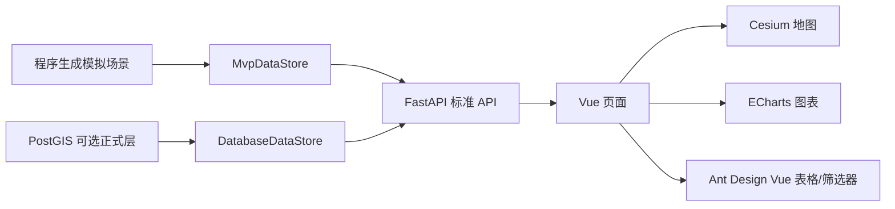

# 系统架构

## 架构目标

系统围绕“稻田数字孪生演示场景”组织，而不是围绕文件导入流程组织。前端只消费标准化 API；后端负责生成或读取场景、地块、指标、观测和预警。

## 分层

| 层级 | 职责 |
|---|---|
| 前端展示层 | 场景驾驶舱、Cesium 地图孪生、地块画像、指标对比、预警分析 |
| API 层 | FastAPI 路由，只处理 HTTP 输入输出和错误 |
| 服务层 | 场景生成、指标筛选、地图图层、趋势聚合、预警整理 |
| 数据层 | 默认程序生成模拟数据；可选 PostgreSQL + PostGIS |
| 文档层 | 数据模型、API、页面结构、设计规范和部署说明 |

## 数据流

## 后端边界

- 路由函数保持薄层。
- 业务逻辑放在 service 层。
- 响应结构使用 Pydantic schema。
- 默认本地数据由 `demo_data` 和 `mvp_data` 生成。
- PostGIS store 适配同一套 API，不改变前端契约。

## 前端边界

- 页面通过 `src/api` 请求标准化接口。
- Cesium 只承担底图、地块边界、地块着色、点击详情和定位。
- ECharts 用于趋势、排行、状态分布和区域预警。
- 不解析 Excel、GeoJSON 或其他原始文件。
